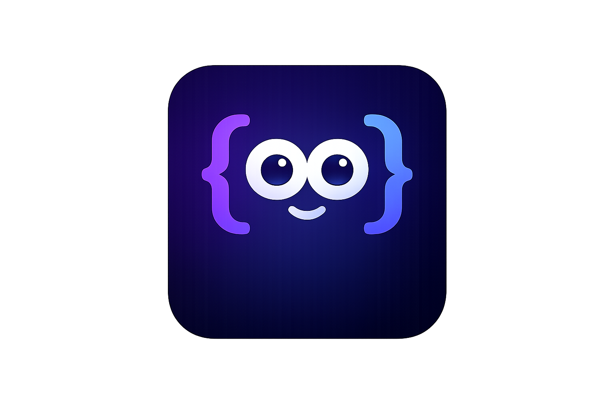
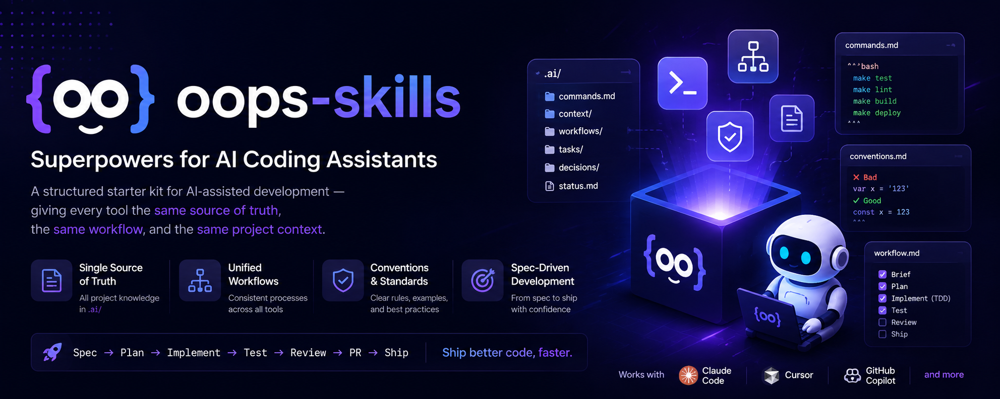

<p align="center">
  
</p>

<h1 align="center">oops-skills</h1>

<p align="center">
  <a href="LICENSE"></a>
  
  <a href="CONTRIBUTING.md"></a>
</p>

<p align="center">
  <em>Starter kit có cấu trúc cho phát triển hỗ trợ bởi AI — cho mọi công cụ cùng một nguồn chân thật, cùng một quy trình, và cùng một ngữ cảnh dự án.</em>
</p>

<p align="center">
  <a href="README.md">English</a> | <strong>Tiếng Việt</strong>
</p>

<p align="center">
  
</p>

---

## Mục lục

- [Tổng quan](#tổng-quan)
- [Tại sao tồn tại](#tại-sao-tồn-tại)
- [Bắt đầu nhanh](#bắt-đầu-nhanh)
- [Quy trình hàng ngày](#quy-trình-hàng-ngày)
- [Cấu trúc thư mục](#cấu-trúc-thư-mục)
- [Nguyên tắc thiết kế](#nguyên-tắc-thiết-kế)
- [Hỗ trợ Legacy](#hỗ-trợ-legacy)
- [Đóng góp](#đóng-góp)

---

## Tổng quan

`oops-skills` là một starter kit drop-in chuẩn hóa cách các công cụ AI tương tác với repository của bạn.

Thay vì rải hướng dẫn và lệnh ra nhiều tập tin, kit này gom mọi thứ quan trọng vào thư mục `.ai/` — để Claude Code, Cursor, GitHub Copilot và bất kỳ agent nào hiểu markdown đều dùng chung một cơ sở kiến thức.

---

## Tại sao tồn tại

Phần lớn workflow AI thất bại vì:

- Hướng dẫn nằm rải rác ở nhiều nơi
- Lệnh được đoán mò thay vì định nghĩa rõ ràng
- Mỗi công cụ tuân theo một quy trình khác nhau
- Ngữ cảnh nhanh chóng trở nên lỗi thời

`oops-skills` khắc phục bằng cách đặt toàn bộ kiến thức dự án trong `.ai/` và để mọi adapter trỏ về đó.

---

## Bắt đầu nhanh

Sao chép vào dự án của bạn:

```bash
cp -r oops-skills/. your-project/
```

Sau đó chạy:

```
/setup-ai-context
```

Lệnh này tự động phát hiện stack và điền các tập tin cốt lõi trong `.ai/`.

Để cấu hình thủ công, chỉnh ba tập tin sau:

| Tập tin | Mục đích |
|---------|---------|
| `.ai/context/architecture.md` | Tổng quan hệ thống — là gì, ai dùng |
| `.ai/context/conventions.md` | Quy tắc code với ví dụ ❌/✅ |
| `.ai/commands.md` | Lệnh build / test / lint / deploy thực tế |

---

## Quy trình hàng ngày

### 1. Thiết lập một lần

```
/setup-ai-context
```

### 2. Đồng bộ trước khi bắt đầu làm việc

```
/sync-ai-context
```

### 3. Luồng tác vụ (xem chi tiết trong `.ai/workflows/task-flow.md`)

```
Phase 1 — Brief
  /clarify-scope          Nhỏ/rõ → tiếp tục. Lớn/mơ hồ → hỏi 1 câu + nêu giả định
  /write-spec             Biên dịch ngữ cảnh thành .ai/tasks/<name>.md
  /plan-tasks             Chia spec thành các bước có tiêu chí "Done when:"

Phase 2 — Implement
  /implement-tdd          Red → Green → Refactor cho từng bước

Phase 3 — Self-check
  /write-test-scenarios   Viết kịch bản chấp nhận và test case
  ✓ Tests xanh, lint sạch, conventions tuân thủ, security đã kiểm tra

Phase 4 — Ship
  /review-pr              Review diff so với spec
  /create-pr-description  Tự động sinh mô tả PR từ spec
  /ship                   Push branch, mở PR, dọn dẹp task file
```

---

## Cấu trúc thư mục

```
.ai/                          # Nguồn chân thật duy nhất cho mọi agent
├── commands.md               # Lệnh trừu tượng → lệnh shell thực tế
├── status.md                 # Trạng thái phối hợp chung
├── context/
│   ├── architecture.md       # Tổng quan hệ thống
│   ├── conventions.md        # Quy tắc code với ví dụ
│   ├── security-checklist.md # Checklist bảo mật trước khi ship
│   └── domain-glossary.md    # Thuật ngữ riêng của dự án
├── workflows/
│   ├── onboarding.md         # Giao thức thiết lập lần đầu
│   └── task-flow.md          # Vòng đời tác vụ 4 phase
├── tasks/
│   ├── TEMPLATE.md           # Mẫu task brief
│   └── <name>.md             # Task brief đang hoạt động
└── decisions/                # Architecture Decision Records (ADR)

.claude/skills/               # Script adapter cho Claude Code
.github/
└── copilot-instructions.md   # Adapter cho GitHub Copilot
.cursorrules                  # Adapter cho Cursor
```

---

## Nguyên tắc thiết kế

1. **`.ai/` là nguồn chân thật duy nhất** — cập nhật một nơi, mọi adapter hưởng lợi.
2. **Lệnh phải rõ ràng và có thể thực thi** — đừng đoán `npm test` nếu dự án dùng `make test`.
3. **Workflow đọc được và không phụ thuộc plugin** — không có ma thuật ẩn, chỉ là tập tin markdown.
4. **Spec dẫn dắt mọi thứ** — Spec → Plan → Implement → Test → Review → PR → Ship.
5. **Trạng thái phối hợp lưu trong file** — `status.md` giúp nhiều agent làm việc song song an toàn.

---

## Hỗ trợ Legacy

Để giúp các dự án đã tồn tại hoặc adapter cũ không phải thay đổi ngay:

- Thêm `LEGACY.md` mô tả cách mapping các lệnh cũ sang `.ai/commands.md` mới.
- Tùy chọn cung cấp script `legacy-migrate.sh` để phát hiện và báo các lệnh/CI đã cũ.
- Liên kết `LEGACY.md` rõ ràng trong README để người dùng biết chỗ tìm.

Gợi ý nội dung `LEGACY.md`:

- Bảng mapping: `lệnh-cũ` → tương ứng trong `.ai/commands.md`
- Các bước thủ công tối thiểu để giữ CI job cũ chạy song song
- Lời khuyên rollback nếu migration xảy ra lỗi

---

## Đóng góp

Xem [CONTRIBUTING.md](CONTRIBUTING.md) để biết hướng dẫn đầy đủ.

Tóm tắt nhanh:
- Fork → tạo branch từ `main` → mở PR
- Tuân thủ `.ai/context/conventions.md` trước khi mở PR
- Chạy self-check trong Phase 3 của `.ai/workflows/task-flow.md` trước khi yêu cầu review

---

Cấp phép theo [MIT License](LICENSE).
